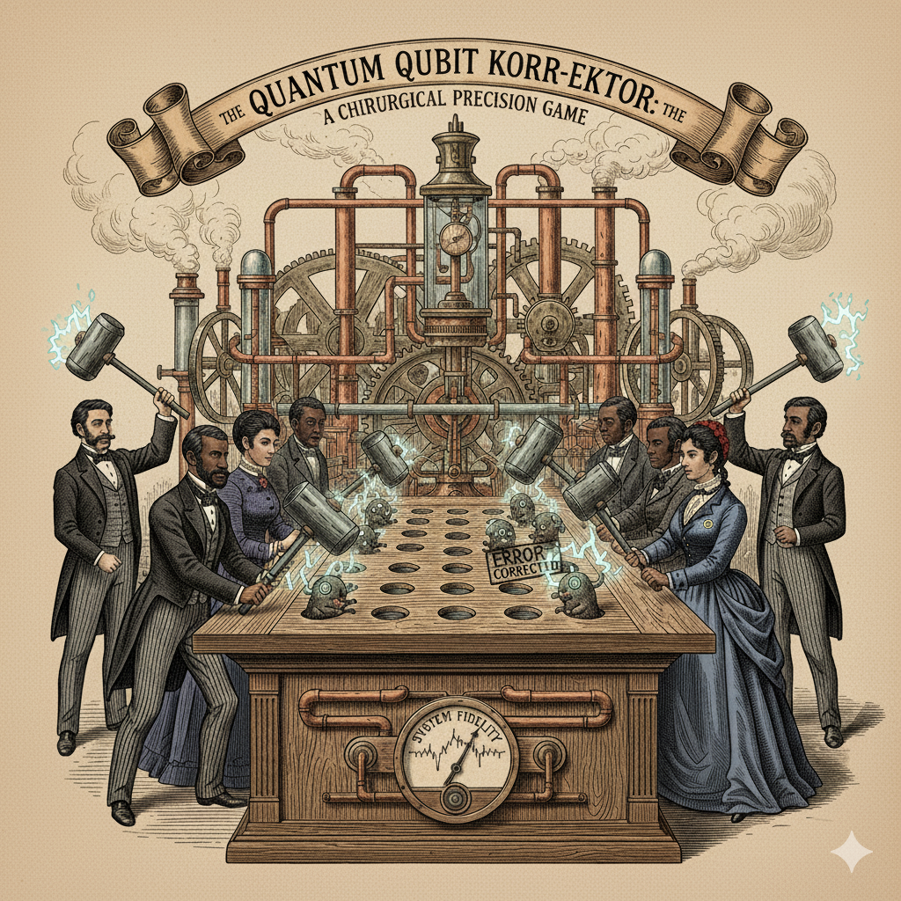

# QEC Frameworks

**Quantum Error Correction Frameworks - Exploring the Open-Source Landscape**
An exploration and comparison of open-source frameworks for quantum error correction (QEC), aimed at researchers, developers, and practitioners working with fault-tolerant quantum computing.

👷‍♂️ WORK IN PROGRESS! STILL UNDERGOING TESTING 🔨.   
📝 SUGGESTIONS WELCOME 🙏



## Overview

Quantum error correction is essential for building practical, large-scale quantum computers. This repository serves as a resource for understanding and evaluating the various open-source frameworks available for implementing and researching QEC codes, decoders, and error mitigation techniques.

## What is Quantum Error Correction?

Quantum Error Correction (QEC) addresses the critical challenge of maintaining accurate quantum information despite the inherent fragility of qubits. Unlike classical error correction, QEC must handle:

- **Bit-flip errors**: Transitions between |0⟩ and |1⟩ states
- **Phase-flip errors**: Changes to the relative phase of quantum states
- **Decoherence**: Loss of quantum properties over time

QEC works by encoding logical qubits across multiple physical qubits using quantum entanglement and superposition, allowing errors to be detected and corrected without collapsing the quantum state.

## Featured Frameworks

### 1. **Qiskit QEC**
- **Organization**: Qiskit Community (IBM)
- **Repository**: [qiskit-community/qiskit-qec](https://github.com/qiskit-community/qiskit-qec)
- **Language**: Python
- **Key Features**:
  - Open-source framework for developers, experimentalists, and theorists
  - Comprehensive support for stabilizer codes
  - Pauli operator representations and conversions
  - Built on the Qiskit ecosystem
- **Use Cases**: Research, education, and development of QEC codes
- **Status**: Early development stage with active community contributions

### 2. **CUDA-Q QEC**
- **Organization**: NVIDIA
- **Documentation**: [CUDA-QX QEC](https://nvidia.github.io/cudaqx/components/qec/introduction.html)
- **Language**: C++/CUDA
- **Key Features**:
  - GPU-accelerated quantum error correction
  - Extensible decoder framework (`cudaq::qec::decoder`)
  - Pre-built codes: Steane code [[7,1,3]], Repetition codes
  - Memory circuit experiments for testing QEC performance
  - CSS (Calderbank-Shor-Steane) code support
- **Use Cases**: High-performance QEC simulations, numerical experiments
- **Advantage**: Hardware acceleration for large-scale simulations

### 3. **QEC-Playground**
- **Repository**: [yuewuo/QEC-Playground](https://github.com/yuewuo/QEC-Playground)
- **Language**: Rust, Python bindings
- **Key Features**:
  - Educational tool and research platform
  - Focus on surface codes
  - 3D GUI for visualization
  - Multiple decoder implementations (MWPM, ML-optimized)
  - FPGA support
  - Benchmarking tools for logical error rates
- **Use Cases**: Education, surface code research, interactive learning
- **Advantage**: Visual interface and educational focus

### 4. **QDX (Quantum Discovery with Jax)**
- **Repository**: [jolle-ag/qdx](https://github.com/jolle-ag/qdx)
- **Language**: Python (Jax)
- **Key Features**:
  - AI-powered QEC code discovery using reinforcement learning
  - Discovers codes and encoding circuits from scratch
  - Noise-aware training for multiple noise models
  - GPU-parallelized training with vectorized environments
  - Clifford circuit simulation in Jax
- **Use Cases**: Automated code discovery, RL research in QEC
- **Advantage**: Machine learning approach to QEC code design

## Common QEC Codes

### Stabilizer Codes
- **Shor Code**: [[9,1,3]] - Encodes one logical qubit into nine physical qubits
- **Steane Code**: [[7,1,3]] - Seven-qubit code, more efficient than Shor
- **Surface Code**: 2D lattice-based topological code with local measurements
- **Color Codes**: Multi-dimensional topological codes
- **LDPC Codes**: Quantum low-density parity-check codes for reduced overhead

### Code Properties
- **Distance (d)**: Number of errors the code can detect/correct
- **Encoding**: Number of physical qubits per logical qubit
- **Threshold**: Maximum physical error rate for fault tolerance

## Framework Comparison

| Framework | Language | GPU Support | Decoders | ML/AI | Education | Production-Ready |
|-----------|----------|-------------|----------|-------|-----------|------------------|
| Qiskit QEC | Python | No | Yes | Partial | ✓ | Early Stage |
| CUDA-Q QEC | C++/CUDA | ✓ | Yes | No | Partial | Beta |
| QEC-Playground | Rust | No | Multiple | Yes | ✓ | Research |
| QDX | Python/Jax | ✓ | RL-based | ✓ | No | Research |

## Getting Started

### Prerequisites
- Python 3.8+ (for Python-based frameworks)
- CUDA toolkit (for GPU-accelerated frameworks)
- Rust toolchain (for QEC-Playground)
- Basic understanding of quantum computing and linear algebra

### Installation Examples

#### Qiskit QEC
```bash
pip install qiskit-qec
```

#### CUDA-Q QEC
```bash
# Follow NVIDIA CUDA-Q installation guide
pip install cudaq
```

#### QEC-Playground
```bash
git clone https://github.com/yuewuo/QEC-Playground
cd QEC-Playground/backend/rust
cargo build --release
```

#### QDX
```bash
git clone https://github.com/jolle-ag/qdx
cd qdx
pip install -e .
```

## Research Areas

### Active Research Topics
1. **Low-Overhead QEC**: Developing codes with reduced physical qubit requirements
2. **Machine Learning Decoders**: Neural network-based error decoding
3. **Fault-Tolerant Operations**: Transversal gates and magic state distillation
4. **Real-Time Decoding**: Fast syndrome extraction and correction
5. **Noise-Adaptive Codes**: QEC strategies that adapt to hardware noise profiles
6. **Topological Codes**: Surface codes, color codes, and their variants

## Resources

### Learning Materials
- [Qiskit QEC Documentation](https://qiskit-community.github.io/qiskit-qec/)
- [Nielsen & Chuang - Quantum Computation and Quantum Information](https://www.cambridge.org/core/books/quantum-computation-and-quantum-information/01E10196D0A682A6AEFFEA52D53BE9AE)
- Gottesman's Stabilizer Formalism Papers

### Community
- Qiskit Slack: QEC channel
- arXiv: quant-ph category (Quantum Error Correction)
- Q2B Conference and Quantum Error Correction Workshops

## Contributing

This repository welcomes contributions including:
- Framework comparisons and benchmarks
- Tutorial notebooks
- Documentation improvements
- New framework additions
- Performance analyses

Please open an issue or pull request to contribute.

## Applications

### Near-Term (NISQ Era)
- Error mitigation techniques
- Quantum chemistry simulations with error awareness
- Variational quantum algorithms with error suppression

### Long-Term (Fault-Tolerant Era)
- Logical quantum processors
- Large-scale quantum algorithms (Shor's, Grover's)
- Quantum simulation of complex systems
- Cryptography and secure communications

## Challenges

Current challenges in QEC implementation:
- **Overhead**: Thousands of physical qubits per logical qubit
- **Real-Time Processing**: Fast classical processing for syndrome measurement
- **Scalability**: Coordinating error correction across large quantum processors
- **Hardware Constraints**: Limited qubit connectivity and gate fidelities
- **Threshold Requirements**: Achieving error rates below fault-tolerance thresholds

## Future Directions

- Integration of AI/ML for adaptive error correction
- Hardware-efficient codes for specific quantum architectures
- Cross-platform QEC standards and interfaces
- Hybrid classical-quantum error correction strategies
- Bosonic codes for continuous-variable quantum computing

## License

This repository is provided for educational and research purposes. Please refer to individual framework licenses for usage terms.

## Citation

If you use this repository or the frameworks discussed here in your research, please cite the relevant papers and repositories:

```bibtex
@misc{qec-frameworks,
  author = {Ian Buckley},
  title = {QEC Frameworks: Exploring Open-Source Quantum Error Correction},
  year = {2025},
  publisher = {GitHub},
  url = {https://github.com/roguetrainer/qec-frameworks}
}
```

## Acknowledgments

Thanks to the quantum computing community and the developers of open-source QEC frameworks who make this research accessible to all.

---

**Maintained by**: [@roguetrainer](https://github.com/roguetrainer)  
**Organization**: N/A  
**Last Updated**: 2025

For questions, suggestions, or collaboration opportunities, please open an issue or reach out through GitHub.
