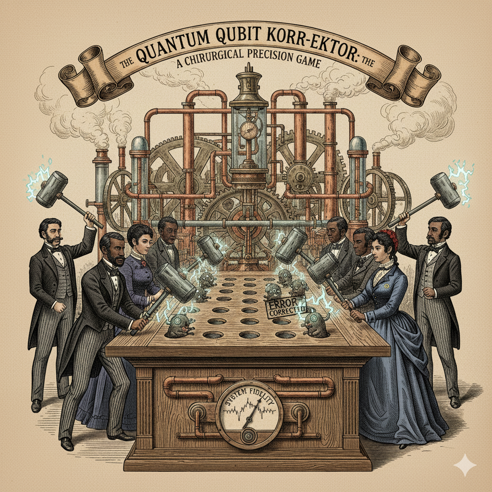

# Quantum Error Correction Frameworks - Getting Started Guide

👷‍♂️ WORK IN PROGRESS! STILL UNDERGOING TESTING 🔨.   
📝 SUGGESTIONS WELCOME 🙏



Welcome! This repository contains comprehensive getting-started code and documentation for two leading quantum error correction (QEC) frameworks:

## 📚 Contents

1. **loom_getting_started.py** - Complete guide to Loom by Entropica Labs
2. **deltakit_getting_started.py** - Complete guide to Deltakit by Riverlane
3. **COMPARISON.md** - Detailed comparison of both frameworks

## 🚀 Quick Start

### Loom by Entropica Labs

**What is Loom?**
Loom is an open-source Python library for designing, simulating, and validating quantum error correction codes. It features Entwine, a visual GUI for drag-and-drop lattice surgery design.

**Installation:**
```bash
pip install loom
```

**Key Features:**
- ✅ EKA data structure (single source of truth)
- ✅ Entwine visual GUI for lattice surgery
- ✅ Pre-built codes (Surface, Shor, Steane, Repetition)
- ✅ Multiple simulation backends (Stim, Qiskit)
- ✅ Integration with PennyLane/Catalyst
- ✅ Fully open source (Apache 2.0)

**First Example:**
```python
from loom.code_factory import RepetitionCodeFactory

# Create a distance-3 repetition code
code_factory = RepetitionCodeFactory(distance=3)
code = code_factory.generate_code()
eka = code.to_eka()

print(f"Created code with {len(eka.data_qubits)} data qubits")
```

**Resources:**
- Documentation: https://loom-api-docs.entropicalabs.com/
- Design Guide: https://loom-docs.entropicalabs.com/
- Entwine GUI: https://entwine.entropicalabs.com/
- GitHub: https://github.com/entropicalabs/el-loom

---

### Deltakit by Riverlane

**What is Deltakit?**
Deltakit is a comprehensive SDK for learning, developing, and deploying quantum error correction. It includes an interactive textbook and connects to Riverlane's cloud-based high-performance decoders.

**Installation:**
```bash
# Step 1: Get your free token at https://deltakit.riverlane.com/
# Step 2: Install
pip install deltakit

# Step 3: Configure
python -c "from deltakit import Client; Client.set_token('YOUR_TOKEN')"
```

**Key Features:**
- ✅ Interactive textbook with 4 learning modules
- ✅ Cloud-connected proprietary decoders (LCD, BP-AC)
- ✅ Advanced noise models including leakage
- ✅ qLDPC code support (bivariate bicycle codes)
- ✅ Deltaflow integration for hardware deployment
- ✅ Production-ready workflows

**First Example:**
```python
from deltakit import SurfaceCode, MemoryExperiment

# Create a surface code
code = SurfaceCode(distance=3)

# Run a memory experiment
experiment = MemoryExperiment(code=code, num_rounds=5)
results = experiment.run(shots=1000)

print(f"Logical error rate: {results.logical_error_rate:.4f}")
```

**Resources:**
- Website: https://deltakit.riverlane.com/
- Interactive Textbook: https://deltakit.riverlane.com/textbook
- Documentation: https://deltakit.riverlane.com/docs
- Get Token: https://deltakit.riverlane.com/ (free registration)

---

## 🎯 Which Framework Should You Use?

### Use Loom if you:
- Want to design custom QEC codes
- Need visual circuit design (Entwine GUI)
- Work extensively with lattice surgery
- Prefer full open-source solutions
- Do academic research requiring flexibility
- Want integration with PennyLane

### Use Deltakit if you:
- Are learning QEC from scratch (interactive textbook)
- Need production-ready QEC workflows
- Want access to state-of-the-art decoders
- Work with qLDPC codes
- Plan hardware deployment via Deltaflow
- Need realistic leakage modeling

### Use Both if you:
- Want the best of both worlds! 🎉
- Many practitioners use Deltakit's textbook to learn, then Loom for custom development
- Or use Loom for prototyping and Deltakit for production deployment

---

## 📖 Detailed Examples Included

### Loom Examples (10 examples)
1. ✅ Creating repetition codes
2. ✅ Working with surface codes
3. ✅ Building memory experiments
4. ✅ Stim backend simulation
5. ✅ Various QEC codes (Shor, Steane, Five-qubit)
6. ✅ Lattice surgery operations
7. ✅ Custom circuit building with EKA
8. ✅ Entwine visual GUI integration
9. ✅ Syndrome decoding
10. ✅ Threshold analysis

### Deltakit Examples (13 examples)
1. ✅ Setup and configuration
2. ✅ Repetition code circuits
3. ✅ Surface code implementation
4. ✅ Memory experiments
5. ✅ Decoder comparison (MWPM, LCD, BP-AC)
6. ✅ Advanced noise models
7. ✅ qLDPC codes (bivariate bicycle)
8. ✅ Leakage-aware simulation
9. ✅ Stability experiments
10. ✅ Circuit transpilation
11. ✅ Visualization and analysis
12. ✅ Deltaflow hardware integration
13. ✅ Interactive textbook workflow

---

## 🔬 Key Concepts Explained

### Quantum Error Correction (QEC)
Quantum computers are extremely sensitive to noise. QEC protects quantum information by encoding it across multiple physical qubits, allowing errors to be detected and corrected without destroying the quantum state.

### Stabilizers
Mathematical operators that define the QEC code. Measuring stabilizers (syndrome extraction) reveals error information without collapsing the logical quantum state.

### Code Distance
The minimum number of single-qubit errors needed to cause a logical error. Higher distance = better protection but more qubits required. Distance-3 can correct 1 error, distance-5 can correct 2, etc.

### Surface Codes
The leading QEC code for near-term quantum computers. Uses a 2D lattice of qubits with stabilizers on plaquettes. High error threshold (~1%) and practical implementation.

### Lattice Surgery
A technique for performing logical operations on surface code patches by merging and splitting them. Enables universal quantum computation on surface codes.

### qLDPC Codes
Quantum Low-Density Parity-Check codes. Next-generation codes with better encoding rates (more logical qubits per physical qubit) but more complex decoding.

### Decoders
Algorithms that analyze syndrome measurements to determine the most likely errors. Examples:
- **MWPM**: Minimum Weight Perfect Matching
- **LCD**: Local Clustering Decoder (Riverlane proprietary)
- **BP-AC**: Belief Propagation with Automorphism Clustering

---

## 🛠️ Technical Requirements

### For Loom:
- Python 3.8+
- Optional: Poetry for development
- Stim backend recommended for fast simulation
- Works on Linux, macOS, Windows

### For Deltakit:
- Python 3.8+
- Free account token from deltakit.riverlane.com
- Internet connection for cloud services
- Works on Linux, macOS, Windows

---

## 📊 Performance Notes

### Simulation Speed:
- **Loom** with Stim backend: Very fast for stabilizer circuits
- **Deltakit** with cloud decoders: Optimized for large-scale experiments

### Code Distance Scaling:
- Distance-3: ~10-20 physical qubits
- Distance-5: ~40-50 physical qubits
- Distance-7: ~90-100 physical qubits
- Distance-9: ~160-180 physical qubits

### Memory Experiments:
- 1000 shots at distance-3: < 1 second
- 1000 shots at distance-7: Few seconds
- Real-time decoding needed for hardware: Use Deltaflow

---

## 🤝 Community and Support

### Loom Community:
- GitHub Issues: Report bugs, request features
- Email: info@entropicalabs.com
- QEC Challenge: Annual competition
- Singapore-based team

### Deltakit Community:
- Community Forums: User discussions
- VP of QEC Community: Liz Durst (former Qiskit lead)
- Enterprise Support: Available for partnerships
- Cambridge UK-based team

---

## 📈 Learning Path

### Beginner (New to QEC):
1. Start with **Deltakit textbook Module 1** - Learn why QEC is needed
2. Try **Deltakit textbook Module 2** - Understand repetition codes
3. Run **deltakit_getting_started.py examples 1-4**
4. Read **COMPARISON.md** to understand both frameworks

### Intermediate (Know QEC basics):
1. Work through **Deltakit textbook Modules 3-4** - Surface codes and decoding
2. Try **Loom's Entwine GUI** - Visual design experience
3. Run **loom_getting_started.py examples 1-6**
4. Run **deltakit_getting_started.py examples 5-9**

### Advanced (Research/Development):
1. Study **Loom's EKA architecture** - Fine-grained control
2. Explore **Deltakit's qLDPC codes** - Next-gen codes
3. Try **lattice surgery** in both frameworks
4. Compare **decoder performance** (examples included)
5. Consider **hardware deployment** via Deltaflow

---

## 🔮 Future Directions

### Industry Trends:
- **Error Threshold**: Current ~1% for surface codes, improving
- **Logical Qubits**: Moving from 10-100 toward 1000-10000
- **Real-time Decoding**: Essential for hardware, both platforms addressing this
- **qLDPC Adoption**: Growing interest in better encoding rates

### Framework Evolution:
- **Loom → Quilt**: Entropica's vision for Fault-Tolerance OS
- **Deltakit → MegaQuOp**: Riverlane's goal for million quantum operations
- **Convergence**: Both moving toward hardware integration

---

## 💡 Tips for Success

1. **Start Simple**: Begin with repetition codes before surface codes
2. **Use Visualization**: Leverage Loom's Entwine or Deltakit's plotting
3. **Compare Decoders**: Try different decoders on the same problem
4. **Understand Thresholds**: Run threshold analyses to build intuition
5. **Read Papers**: Both frameworks cite key QEC papers
6. **Join Communities**: Engage with other practitioners
7. **Experiment**: Modify the example code to learn deeply

---

## 📚 Recommended Reading

### Essential Papers:
1. Surface codes: "Surface codes: Towards practical large-scale quantum computation" (Fowler et al., 2012)
2. Stabilizer formalism: "Stabilizer Codes and Quantum Error Correction" (Gottesman, 1997)
3. Thresholds: "Overhead and noise threshold of fault-tolerant quantum error correction" (Tomita & Svore, 2014)

### Books:
1. "Quantum Error Correction" by Lidar & Brun
2. "Quantum Computation and Quantum Information" by Nielsen & Chuang

### Online Resources:
1. Deltakit Interactive Textbook (best for beginners)
2. Loom Documentation (best for implementers)
3. Qiskit Textbook QEC chapter

---

## 🎓 Citation

If you use these frameworks in your research:

**For Loom:**
```
@software{loom2025,
  title = {Loom: Quantum Error Correction Framework},
  author = {Entropica Labs},
  year = {2025},
  url = {https://github.com/entropicalabs/el-loom}
}
```

**For Deltakit:**
```
@software{deltakit2025,
  title = {Deltakit: Quantum Error Correction SDK},
  author = {Riverlane},
  year = {2025},
  url = {https://deltakit.riverlane.com/}
}
```

---

## 🙏 Acknowledgments

- **Entropica Labs** for open-sourcing Loom and creating Entwine
- **Riverlane** for Deltakit and advancing real-time QEC
- The **quantum computing community** for foundational research
- All **contributors** to both projects

---

## 📝 License

- **This guide**: MIT License (examples and documentation)
- **Loom**: Apache 2.0 License
- **Deltakit**: Check Riverlane's licensing terms

---

## 🚀 Get Started Now!

1. Choose your framework (or try both!)
2. Run the getting started code
3. Read the comparison document
4. Join the community
5. Start building quantum error correction!

**Questions?** Open an issue or reach out to the respective communities.

**Happy quantum error correcting!** 🎉🔬✨
